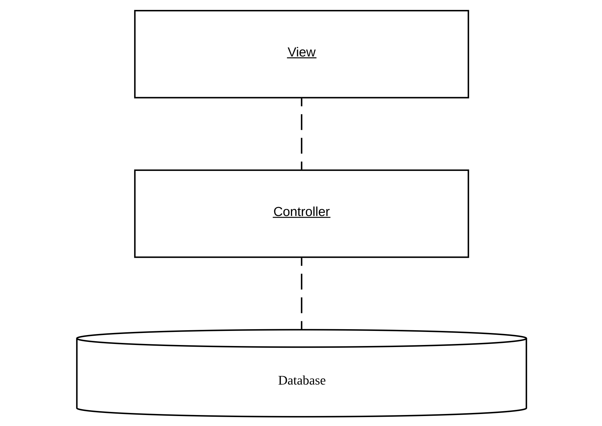
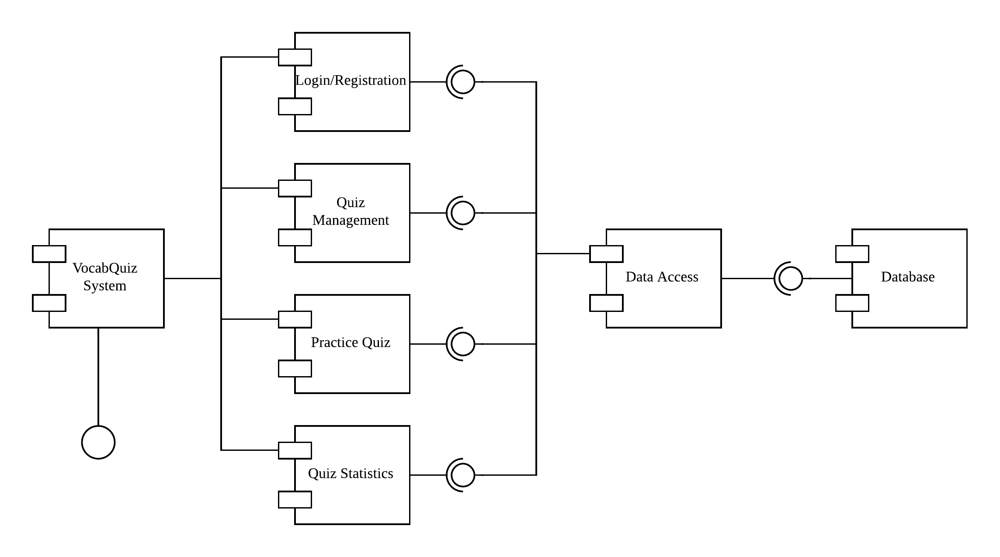
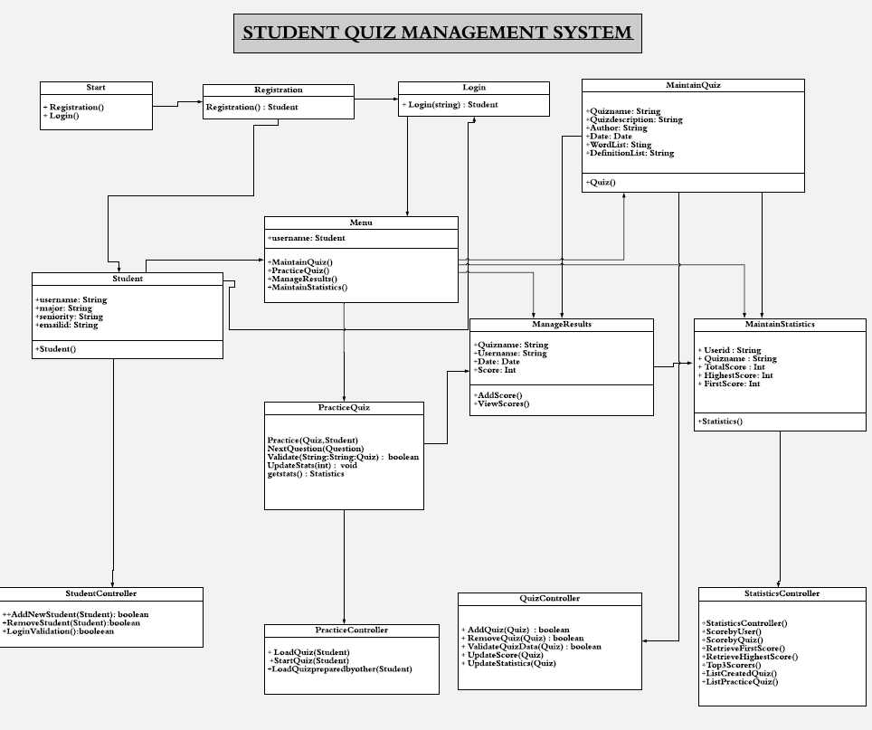
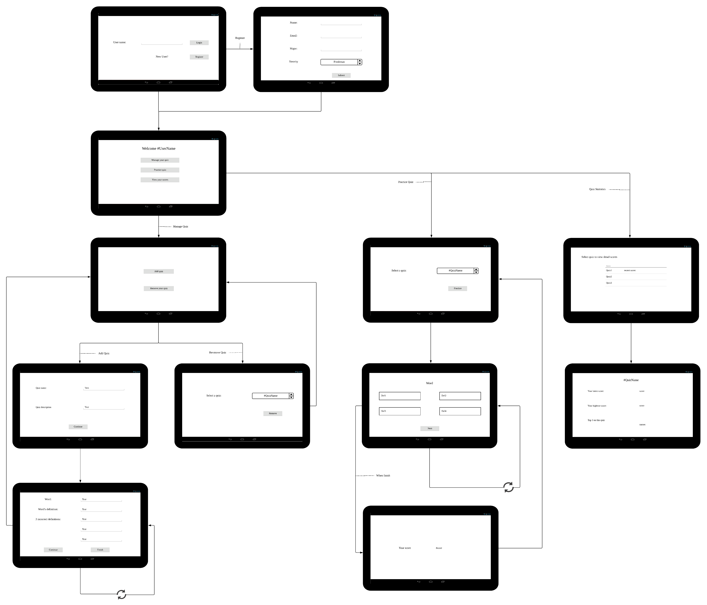

# Design Document

## 1 Design Considerations

a. Seamless User Experience and Design:
Time is a very important factor these days and an app should be designed such that the user interface is simple, easy to navigate and has a less response time. Keeping that in mind, we intend to keep the app interface and coding simple and easy to implement.

b. Interactivity and Engagement:
An app which will be used heavily by student population should be easy to interact with. The app will be designed with simple and intuitive screens that will keep the student engaged and make it easy to navigate around.

c. Visual appearance and Navigation:
The quiz app should have a good aesthetic interface and should have the right combinations of colors and fonts, since such visual markers play an important role in decision making. Words will be marked differently to emphasize that they are questions and proper color selections will be provided to indicate the answer choosen, words that have not been answered yet etc.

### 1.1 Assumptions

This project is to develop an Android application that will be installed on a tablet that will be shared among students. Multiple users/students are able to login or register. After login/register, user can create or delete his/her own quiz, user can practice on any quiz that has been created by the other users, user can also view his/her quiz results or compare it with other users. It will be assumed at any point of time only one user is logged to the quiz app from a locally shared tablet, hence multi user authentication in parallel is out of the scope of this project. Also, since only one student will be active at a single point of time, a local database to store the data is sufficient and a distributed data storage system is not needed. There will also be no necessity to store user passwords for login authetication. Only the user names will be stored in the local database and used for authentication purposes.

### 1.2 Constraints

The system runs locally on a shared tablet, so all data are stored locally as a database. 

It is mandatory to implement a simple user interface due to the fact that we will be using the Andriod SDK emulators for testing and these are generally slow to load and have their own limitations.

### 1.3 System Environment

The app will be compiled on Android SDK version 28, minimum SDK version is 26. App will be tested on emulators available within the Android sdk and android tablet. 

## 2 Architectural Design

The system contains three levels:

* View: the user interface that the user will interact with. User interface provides responses - display different screens/user interfaces/forms, captures the data that users input and alert the users when incorrect information has been input or data is missing or other significant actions like data save, quiz completion etc happens.
* Controller: Provides methods for the View/user interface to access data. The controller acts as the interface between the user interface front end and the data storage backend.
* Database: Data repository where all student and quiz data is stored.

### 2.1 Component Diagram

<!-- The main functional component of this app is the quiz. Different controller systems exist for Student Maintenance, Quiz Maintenance, Managing practice quizzes and Statistics/Report Maintenance. 

Registration and Login components are implemented as separate classes since Registration is a separate process where an user is able to register as a student by providing valid information like name, major, seniority and email. After registration, a registered user i.e a student is able to logon to the system. This logon function initiates the session and ensures that all information like details of quizzes taken, scores, statistics etc will persist until the student logs out of the system.

The last component, Results and statistics for the quiz, will be represented as 2 separate classes. This will keep the individual quiz results and overall statistics per user, per session separate. -->

We use Android Room as a wrapper to represent the data base component. DAO (data access object) provides interface for Login/Registration, QuizManagement, PracticeQuiz, and QuizStatistics components.

### 2.2 Deployment Diagram

This is a simple app design and will be deployed only on one tablet. There will be no concurrent deployment to multiple devices.

## 3 Low-Level Design

### 3.1 Class Diagram

Each class will be designed independent of each other in such a way that they are easy to implement.

The user interacts with the Start, Registration, Login, Menu and PracticeQuiz screens.. All controller class interacts with database and provide methods for data manipulation.

## 4 User Interface Design

Program starts from login/registration screen. Each screen corresponds to an Android activity.

