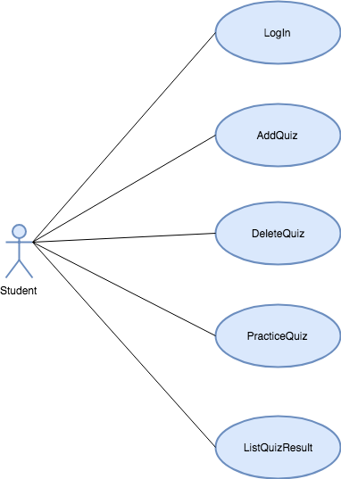

# Use Case Model

## 1 Use Case Diagram

## 2 Use Case Descriptions

### Login
- Requirement: Student can login to the system with a valid userid.
- Pre-conditions: Student has already registered and has a valid user id.
- Post-conditions: Student is able to logon and see the main menu.
- Scenarios:
  - Student enters valid username and clicks on submit to logon.
  - Student enters invalid username and clicks on submit to logon. System displays an error message that the login is invalid. 
  

### AddQuiz
- Requirement: Student can add a new quiz.
- Pre-conditions: Student has logged in with a valid userid.
- Post-conditions: A new quiz has been added to system.
- Scenarios:
  - Student selects QuizAdministration from the Menu to add quiz.      
  - Student is presented with a form to information like quiz name, description, list of N words and definitions. After entering all the information, Student clicks on submit to submit the quiz.   
  - If not all information is filled(e.g. description is missing), a warning message shows up. If the quiz name already exists, system displays a warning message that quiz name already exists. 
  - If everything is correct, then the form would submitted. As soon as a Student submits changes, a change successful message is displayed and user is redirected to the Menu page.

### DeleteQuiz
- Requirements: Student can remove a quiz that they have created.
- Pre-conditions: Student has logged in with a valid username.
- Post-conditions: Quiz has been removed from the system.
- Scenarios:
  - Student selects QuizAdministration from the Menu to delete a quiz. 
  - If the student has not created any quizzes, then display a warning  with message that there are no quizzes to delete. Student can delete only those quizzes that were created by them.
  - If the student has created quizzes, system will display a list of quizzes created by the student.
  - Student might select one quiz or multiple quizzes, then click on submit. The quizzes selected would be deleted from system and all the related scores would be also be deleted.

### PracticeQuiz
- Requirements: Student can practice a quiz that the other students have created.
- Pre-conditions: Student has logged in with a valid user id and student is able to see the list of quizzes created by other students that are available to practice.
- Post-conditions: Quiz scores will be stored in the database.
- Scenarios:
  - Student selects PracticeQuiz from the Menu.
  - List of quizzes available is displayed.
  - Student selects a particular quiz.
  - Quiz screen displays and contains a single Word and four word definition choices.
  - Student selects one of the definitions and moves on to the next word using the next button. 
  - When all the words in the quiz have been tested, system will move on to the final summary page.
  - Student can go back and review the words or click on submit to submit quiz.
  - Correct answers are validate and quiz scores for the student are updated.
  - Student moves on to next available quiz or goes back to main menu.

### ListQuizResults
- Requirements: Student is able to view all the individual quiz results as well as statistical summary results.
- Pre-conditions: Student has logged in with a valid user id and practiced a few quizzes.
- Post-conditions: Student is able to view different score reports.
- Scenarios: 
  - Student selects ListQuizResults from menu
  - System displays list of quiz results that a student can choose to view.
  - Student can click on a particular quiz to view results or click on one of the statistical reports like top3quizzers, firstscore, highestscore, scorebyuser, scorebyquiz etc to view results in details or click on back to go back to the menu.

